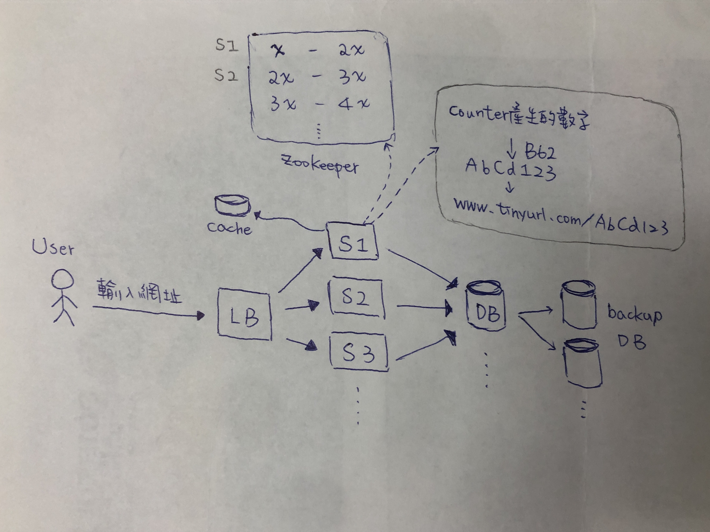

### 短網址服務的後端系統架構圖

### 將網址轉為短網址

1. User 透過瀏覽器輸入原網址，並向 server 發出轉成短網址的請求。

2. 到 server 前會先經過 LB（Load Balance）分配到適合的 server（圖上簡寫為 S）。

3. Server 內有 counter，會向 zookeeper 查詢這台伺服器可以提供數字的範圍，發現都沒有伺服器使用，所以就標記第一列（x - 2x 這一列）給 S1 使用。**[註一]**

4. S1 的 counter 就會依據 zookeeper 所指定的範圍，依序給出一個數字。

5. 這個數字透過 B62（base62）演算法產生一個 7 位的字母加數字，在這裡就成功產生了一個短網址。**[註二]**

6. Server 會將原本的網址&短網址存到資料庫（DB, database），也會存於快取中。另外，每一個 DB 都會有備份的資料庫，供原 DB 失效時使用。**[註三]**

7. 發送 response 將短網址回傳給 user。

**[註一]** Zookeeper 的一列如果用完，便會往下尋找新的一列使用。另外，因為是產生不重複的數字，因此產生的七位數也不會相同，所以不用去 DB 裡查詢是否重複，這種方式可以加速產生短網址的效率。

**[註二]** Base62 就是將進位制改成 62 進位（0-9, A-Z, a-z），取七位數 62^7 約等於 3.5 兆個，若每秒使用 1000個，可以使用 110 年。

**[註三]** 若要提升服務的效率，可以增加 server 的數量；；DB 的部分使用 RDBMS 或 NoSQL 都可以，但若使用 NoSQL 的話較易透過增加 DB 主機來提升 scaling（Horizontal Scaling）。

### 將短網址轉成原網址

1. User 透過瀏覽器輸入短網址，並向 server 發出轉成原網址的請求。

2. 到 server 前會先經過 LB（Load Balance）分配到適合的 server（圖上簡寫為 S）。

3. Server 會先去 cache 找，看是否有符合的資料。

4. 如果 cache 有，傳送原網址給 user；若無則去 DB 查找。

5. 如果 DB 有，傳送原網址給 user；若無則發送 response 告知 user 查無資料。

_____

### 參考資料：

1. [短网址(short URL)系统的原理及其实现](https://hufangyun.com/2017/short-url/) 
2. [短网址系統(TinyURL)](https://soulmachine.gitbooks.io/system-design/content/cn/tinyurl.html)
3. [URL shortener system design | tinyurl system design | bitly system design](https://www.youtube.com/watch?v=JQDHz72OA3c)
4. [RDBMS v.s. NoSQL](https://shininglionking.blogspot.com/2018/04/rdbms-vs-nosql.html)